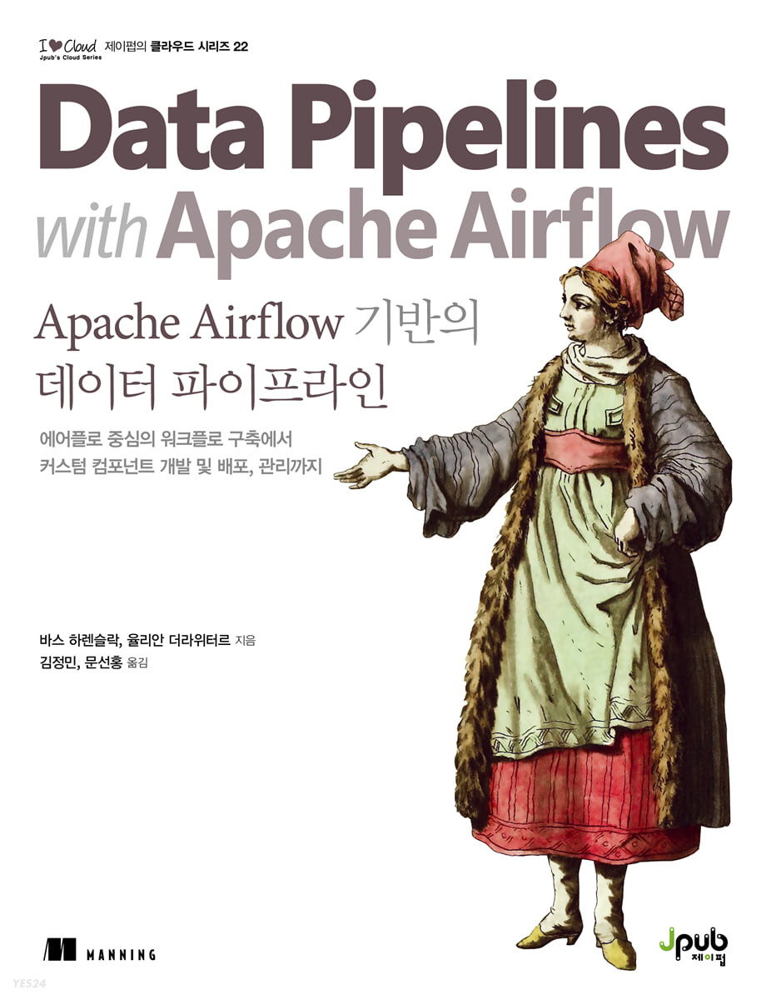

# Apache Airflow 기반의 데이터 파이프라인
이 저장소는 매닝 출판사의 [Apache Airflow 기반의 데이터 파이프라인](https://www.manning.com/books/data-pipelines-with-apache-airflow) 한국어판 도서를 사내 스터디로 진행하며 정리 중인 문서입니다.

매주 한 챕터씩 업데이트 예정이며, 예제 소스코드는 [이곳](https://github.com/K9Ns/data-pipelines-with-apache-airflow)에서 다운받아 진행하였습니다.

<figure></figure>
